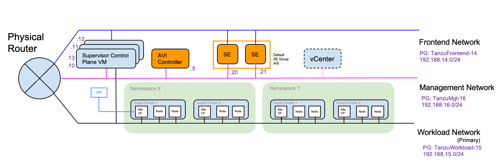

This is a multipart series in which I'll be showing 

## Installing vSphere 7 with Tanzu and NSX Advanced Loadbalancer (AVI)

## Prerequisites

## Overview & Setup

In this tutorial I'm going to describe in detail the setup with vSphere Networking using the NSX Advanced Loabalancer. 

### vSphere with Tanzu - vSphere Networking

## Supervisor Cluster Setup

## Tanzu Kubernetes Cluster Deployment