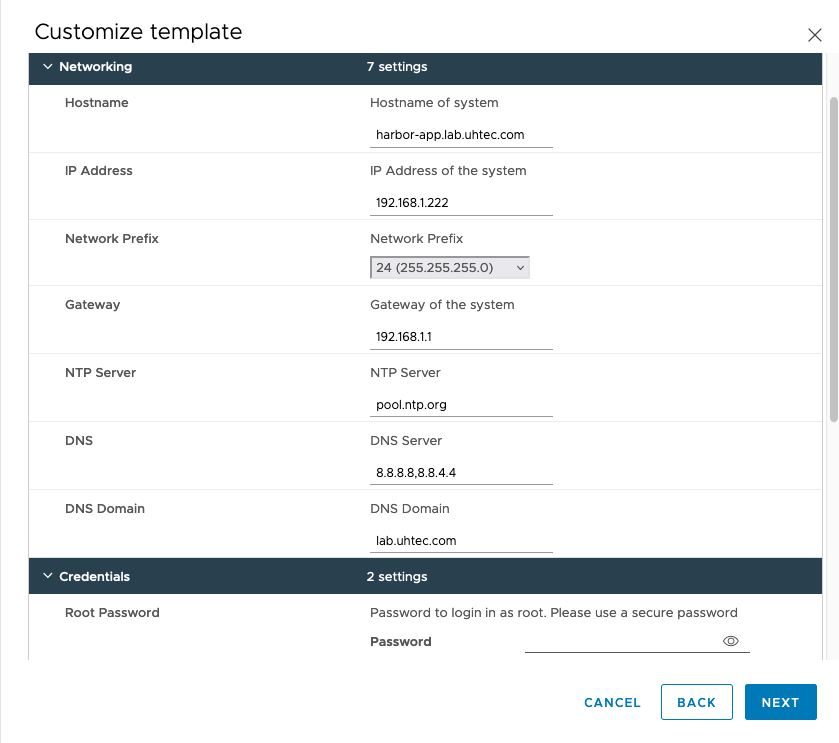
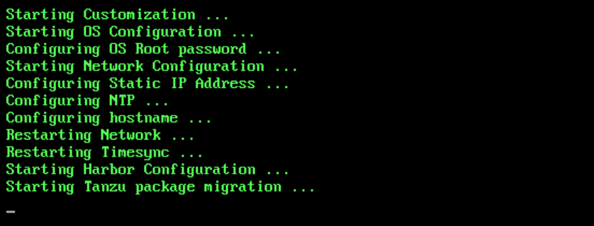
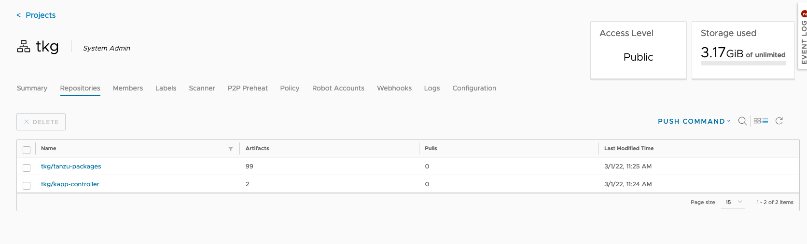

I’m getting more customer engagements with the requirement of air-gapped support for their Tanzu installation. Some of these customers are just starting out and don’t have their own container registry yet. Or in other cases, they don’t allow internet access even through proxies or jump boxes. 

My idea was to create a VM that would bring the tools and images needed to install the Tanzu packages in these air-gapped environments. The result contains:

* docker
* carvel tools (ytt, kapp, imgpkg, kbld)
* kubectl
* Tanzu cli
* Tanzu Packages 1.4
* Tanzu Packages 1.5

My colleague Robert wrote an excellent [post](https://rguske.github.io/post/deploy-tanzu-packages-from-a-private-registry/) about Tanzu packaging and their offline support. He’s using a jump box to download the packages and move them into your own container registry. This approach is fine if you can have a jump box with internet access. But what do you do if there is now internet access at all? 

So I have been playing with [packer](https://www.packer.io/) lately and came across this [post by William Lam](https://williamlam.com/2021/07/packer-reference-for-vmware-harbor-virtual-appliance.html). So my idea was born to combine the two and create a Harbor appliance that already has all Tanzu packages included. The result is this [repository on GitHub](https://github.com/devulrix/harbor-appliance). 



If you prefer not to build the appliance yourself, drop me an email or DM and I can provide you with the link to the Harbor Appliance OVA.



In the OVF properties you can set the hostname, network settings, harbor and root credentials.



After booting the machine for the first time, it will run the configuration. It installs Harbor and creates a *tkg* project. In that project, it pushes the Tanzu Packages 1.4 and 1.5. On top, it pushes the kapp controller image for the 1.4 and 1.5 packages.



Use the harbor hostname you set in the OVA deployment to reach the Web UI. Use admin and your selected password to login.



## Certifcate handling

The appliance generates a self-signed certificate during setup with the hostname you provided during ova deployment. The certificate is stored in the appliance under **/etc/docker/certs.d/[HARBOR-FQDN]/ca.crt** and can be copyied via scp to your local machine. Alternatively, you can download the certificate directly from your browser if you go the Harbor Web UI.

## Deploy Tanzu Cluster

You need to create a Tanzu Kubernetes Cluster that trusts our Harbor appliance. We’re using self-signed certificates, so we must embed this certificate in the cluster configuration. Below, find a Tanzu Cluster deployment example for vSphere with Tanzu. Please adjust to your needs. You need to encode the certificate in base64 before you put it into the cluster configuration.

```yaml {linenos=table,hl_lines=[25,26,27,28],linenostart=1}
 kind: TanzuKubernetesCluster
 metadata:
   name: simple-cluster
   namespace: tkc-test
 spec:
   topology:
     controlPlane:
       replicas: 1
       vmClass: best-effort-xsmall
       storageClass: tanzu-storage
       tkr:
         reference:
           name: v1.21.2---vmware.1-tkg.1.ee25d55
     nodePools:
     - name: workerpool-1
       replicas: 3
       vmClass: best-effort-medium
       storageClass: tanzu-storage
       tkr:
         reference:
           name: v1.21.2---vmware.1-tkg.1.ee25d55
   settings:
     storage:
       defaultClass: tanzu-storage
    trust:
        additionalTrustedCAs:
          - name: HarborAppliance
            data: LS0tLS1C...LS0tCg==
```

## Deploy kapp-Controller

Create a *kapp-controller.yaml* file with the contents from the [docs](https://docs.vmware.com/en/VMware-Tanzu-Kubernetes-Grid/1.4/vmware-tanzu-kubernetes-grid-14/GUID-packages-prep-tkgs-kapp.html#kapp-controller). Adjust the lines *1278* with the new **[HARBOR-FQDN]/tkg** repository location.

```yaml {linenos=table,hl_lines=[3],linenostart=1276}
        - name: KAPPCTRL_API_PORT
          value: "10350"
        image: projects.registry.vmware.com/tkg/kapp-controller:v0.25.0_vmware.1
        name: kapp-controller
        ports:
        - containerPort: 10350
```

Afterwards you can install the kapp-controller: 

```bash {linenos=false,linenostart=1}
kubectl apply -f kapp-controller.yaml
```

## Install packages

You can follow the [excellent description of Robert](https://rguske.github.io/post/deploy-tanzu-packages-from-a-private-registry/#install-the-kapp-controller) on how to deploy the Tanzu Package and configure the kapp-controller. Change the image URL to **[HARBOR-FQDN]/tkg** to use our Harbor appliance.