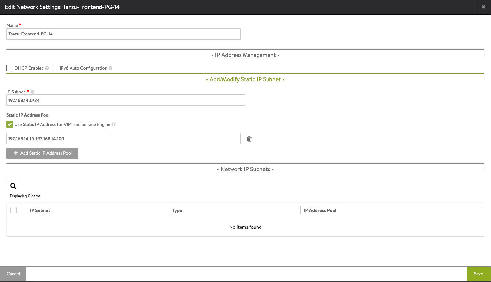

## Overview

In this multi-part series, we will instal Tanzu Kubernetes Grid Service with vSphere 7 and vSphere Networking. With the update of vSphere 7U2, the support for NSX Advanced Load balancer (formally known as AVI) was added. I’ll be using the U3 update for vCenter.



This is not an official VMware Guide. If you’re looking for that, please follow this [guide](https://core.vmware.com/resource/tanzu-proof-concept-guide#poc-guide-overview).



Below you find the corresponding YouTube video of me doing everything described in this article. I stored all files in a [GitHub repository](https://github.com/devulrix/tanzu-poc). You can donwload the network sheet [here](network-sheet.xlsx).



If you’re looking for an easy automated installation, have a look at William Lam’s [repository](https://github.com/lamw/vsphere-with-tanzu-nsx-advanced-lb-automated-lab-deployment). William is building an automated nested environment to get you started in less than an hour.

## Prerequisites

Before we can start, we need to make sure that we meet the minimum criteria for the environment.

* 3 ESXi hosts with vSphere 7.0 and Enterprise Plus license
* vCenter 7.0 U3 or newer
* 3 routed Networks on a distributed switch
  * No firewalling between the 3 networks
  * All networks need to have access to DNS & NTP
  * **Management Network** with 5 consecutive IP addresses and minimum 8 IPs in total
  * **Management Netowrk** needs to reach the vCenter
  * At least one **Workload Network** with the size of the K8s workers you want to support, we’ll be using a /24.
  * One **VIP/Frontend Network** with the size of the Load Balancer Service you want to use, at least 1 for each K8s cluster is needed. I’ll be using a /24 as well.
* vSphere HA & DRS needs to be enabled on the vSphere cluster

For a full list of requirements have a look at the official [documentation](https://docs.vmware.com/en/VMware-vSphere/7.0/vmware-vsphere-with-tanzu/GUID-7FF30A74-DDDD-4231-AAAE-0A92828B93CD.html). We will cover the network setup in much more detail in the [vSphere Networking](#vsphere-with-tanzu---vsphere-networking) section.

## vSphere with Tanzu - vSphere Networking

This section covers the networking needed to set up vSphere with Tanzu and NSX Advanced Load Balancer (NSX ALB). You can only use this setup if you are using vSphere Distributed Switch (VDS).

The ALB provides your Kubernetes’ environment with a dynamic Load Balancer services for your Kubernetes Cluster API endpoints and for Load Balancer services within your cluster. The ALB comprises 3 components, Controller, Service Engine and AVI Kubernetes Operator (AKO).

The controller is the central management component. It provides the web interface for management and interacts with the vCenter. It provisions the service engines and does the monitoring of the resources and logging.

The service engines (SE) are VMs and provide virtual services, Layer 4 and Layer 7 load balancing. The SE is connected to at least two network interfaces, one for management to interact with the controller and the other to expose the virtual services.

The AKO is an operator running in the Supervisor Cluster to monitor Kubernetes resources and communicates with the controller to request load balancing services.

### Network Topology & Requirements

The network topology comprises 3 components: Management, Frontend and Workload network. You have to options on how you can set this up. Either a 2 network setup in which you run the frontend and workload network converged. Or you run a 3 network setup in which you separate frontend and workload network. This is recommended for a production setup and what we will use our PoC setup as well. In the picture below, you can see the details. For a detailed list with all resources and port requirements, have a look at the [documentation](https://docs.vmware.com/en/VMware-vSphere/7.0/vmware-vsphere-with-tanzu/GUID-7FF30A74-DDDD-4231-AAAE-0A92828B93CD.html).


The ALB controller, the Supervisor Cluster VMs and the Service Engines use the management network. This interface is used to connect to the ALB to the Service Engines. The 3 Supervisor VMs take 5 consecutive IPs on the management network, one for each VM, one for the VIP and the 5th during update for an additional Supervisor VM. When the first load balancing service is requested, the ALB will provision 2 Service Engines, each having one interface on the management network. 

The Kubernetes VMs use the Workload network to communicate and to expose their services to the ALB. The network is used by the Supervisor Cluster VMs to communicate with the Tanzu Kubernets clusters. You can have more than one Workload Network, but the Supervisor Cluster VMs will only have an interface to the first (default) workload network.  

The frontend network is used by the Service Engines to provide load balancing services. The engines don’t have an interface to the workload network (one-arm setup). This requires us to set up a default route for the Frontend Network to reach the Kubernetes VMs in the workload network. The Supervisor Cluster VMs get VIP on the Frontend Network as well to expose the Kubernetes API to developers. 

### Create Port Groups on the Distributed Switch

To match our described network setup, we need to create 3 port groups on our distributed switch.

| Port Group Name | CIDR | Gateway | VLAN |
|----------------------|:---------------:|:------------:|------|
| TanzuMgt-PG-16 | 192.168.16.0/24 | 192.168.16.1 | 16 |
| Tanzu-Workload-PG-15 | 192.168.15.0/24 | 192.168.15.1 | 15 |
| Tanzu-Frontend-PG-14 | 192.168.14.0/24 | 192.168.14.1 | 14 |

## NSX Advanced Loabalancer Instalation

If you haven’t downloaded the [NSX Advanced Loadbalancer OVA](https://customerconnect.vmware.com/downloads/details?downloadGroup=NSX-ALB-10&productId=988&rPId=82536) yet please do so. As of this writing I’m using the latest available release, 21.1.3.

We will cover a quick single controller node installation. If you plan to move this into production, you would need to create a 3 node cluster setup with a VIP. Please refer to the [documenation](https://docs.vmware.com/en/VMware-vSphere/7.0/vmware-vsphere-with-tanzu/GUID-A51FAF35-D604-4883-A93D-58463B404C4E.html) for details.

After downloading the OVA, import it into the vCenter. Select your management port group for the management network (**TanzuMgt-PG-16**).


For manager configuration, select the values from our spreadsheet. In the demo environment, this results in:

* Management Interface IP Adress: 192.168.16.10

* Management Interface Subnet Mask: 255.255.255.0

* Default Gateway: 192.168.16.1


We do not need all other settings for our setup to work. We’re not using an NSX-T network environment. After configuring the VM, power it on and put the management interface IP into your browser. The startup will take a few minutes.

When web interface is up, you need to create a password for the admin user, the email is optional. This user is used for the configuration by the Supervisor Cluster as well.


Next is the basic setup. Put in the passphrase for backup and your DNS servers, DNS search domain. The email settings are optional. For *Multi-Tenant* leave everything as is.


Select *Setup Cloud After* before you hit *Save*.

Before we setup anything else in the management console, we will first switch the license from the current *Enterprise with Cloud Services Tier* trial license to the *Essentials Tier* license. Go to **Administration** at the top and then **Settings > Licensing**. This way, we cannot accidentally activate any enterprise features that are not included in the *Essentials Tier*, which is part of the Tanzu Basic/Standard offering.


Next, the *Default-Cloud* needs to be configured. Go to **Infrastructure** and then **Clouds**, click on the *gear* icon and select vSphere as the orchestrator. Afterwards click on the pen button to configure the *Default-Cloud*.


Under *Infrastructure* put in the vCenter info and click *Next*.


For *Data Center* select your vSphere Data Center. If you have DHCP in your environment, select DHCP here. As discussed in the [vSphere Networking](#vsphere-with-tanzu---vsphere-networking) segment, we assume everything is static. For *Virtual Service Placement Settings* select *Prefer Static Routes vs Directly Connected Network*.


In the *Network* tab, select the *Management Network* from your spreadsheet. In the example **TanzuMgt-PG-16**. If the management network uses DHCP, select *DHCP Enabled* otherwise put in the IP Subnet. The IP Adress Pool needs to comprise at least 2 IPs. They’re used by the service engines. There **should not** be any overlap with the IPs of the Supervisor Cluster VMs.

* IP Subnet: 192.168.16.0/24

* Add Static IP Adress Pool: 192.168.16.11-192.168.16.14

* Default Gateway: 192.168.16.1


After saving everything, make sure the *Default-Cloud* has a green circle.


The default SSL certificate of the NSX Advanced Load Balancer doesn’t contain the IP address. So we need to generate a new one. Go to **Templates** and then **Security > SSL/TLS Certificates**. Click on *Create* and select *Controller*.


Fill out the certificate. Put the IP address into the SAN section and the DNS name in to the *Common Name* field. If you only have an IP put in the IP for the *Common Name*.


Click on the download button of the certificate and copy the certificate to a text file. We need it later during the installation of the Supervisor Cluster.

Next we need to make use of our newly created certificate. Go to **Administration** and select **Settings > Access Settings**. Click on edit.


Remove all entries in *SLL/TLS Certificate* and select our own certificate. Activate **Allow Basic Authentication** as well, if you miss this step, the installation of the Supervisor Control Plane will fail.


Now we need to configure the *Service Engine Group*, go to **Infrastructure** and select **Cloud Resources > Service Engine Group**. Click on the edit button for the *Default-Group*.


In the *Basic Settings* select *Legacy HA*. The default *Virtual Services per Service Engine* value of 10 will limit you to 10 Load Balancer Services in your installation, change this to, e.g. 100.


In the *Advanced* tab, you can change the engine's VM prefix and the VM folder. Select your vSphere cluster in the *Cluster* settings. You can select on which hosts the service engines should run.


Configuring the networks used by the Load Balancer is the next setp. Go to **Infrastructure** and then **Cloud Resources > Networks**. The *Default-Cloud* will show all Portgroups on our Distributed Switch. It will try to detect the subnets. We need to configure the subnet parts we want to use.


The only network we need to configure is the frontend network, as we’re using a single leg setup. Click the edit button on the Frontend (**Tanzu-Frontend-PG-14). If the network is using DHCP, select it here. Otherwise put in the information according to the spreadsheet.

* IP Subnet: 192.168.14.0/24

* Static IP Adress Pool: 192.168.14.10-192.168.14.100

This allows us to create 90 Load Balancer services, starting with *192.168.14.10*.



The NSX Advanced Load Balancer Essential License does not include the *Auto Gateway Detection* feature. So we need to create a default route. Go to **Infrastructure** and select **Cloud Resources > Routing**. Click Create.


We need to create a default route. The *Next Hop* is the Gateway of our Frontend network.

* Gateway Subnet: 0.0.0.0/0

* Next Hop: 192.168.14.1


After configuring the network and the routing, we need to configure the *IPAM Profiles*. Go to **Templates > Profiles > IPAM/DNS Profiles**. Click on Create.


The profile needs a name. Select:

* Cloud for Usable Network: Default-Cloud

* Usable Network: Your Frontend Network (**Tanzu-Frontend-PG-14**)


The final step is to assign the IPAM profile to the *Default-Cloud*. Go to **Infrastructure** and then **Clouds**. Click on the pen button to configure the *Default-Cloud*. Assign the *IPAM Profile* our created profile, (*tanzu-ip*).


This was the last step in the NSX Advanced Load Balancer setup.

## Supervisor Cluster Installation

After setting up the network and Load Balancer, we now need to configure the content library. The library contains all supported Kubernetes versions.

If you don’t already have a storage policy that you would like to use for Kubernetes, we need to create one. 

Now we have everything we need to finally install the Supervisor control plane. Make sure you use the spreadsheet to keep track of all IPs and settings used.

### Tanzu Content Library

In the vCenter, go to **Content Libraries** and click on Create. You need to specify the name. We use *tanzu* for the rest of the tutorial.


Next select *Subscribed content library* and put in the Subscription URL: **[https://wp-content.vmware.com/v2/latest/lib.json](https://wp-content.vmware.com/v2/latest/lib.json)**. Select *Download content: when needed* to save some space. Otherwise, it will download 27 VM images for the different Kubernetes versions.


You need to accept the certificate from the content library.


Select the storage you want and hit the finish button on the next page.


Now everything is set up to finally install the Supervisor Cluster.

### Tanzu Storage Policy

The storage for the Supervisor Control Plane, the Tanzu Kubernetes Clusters and the Storage Classes within the Kubernetes Cluster can only be assigned if we have *Storage Policy* in place. If you already have one you can skip this section, just put the name on the spreadsheet.

The easiest way to create a new policy is to create a tag based rule for one of your Datastores. Click on the *Assign* button.


Click the *ADD TAG*


Put in the name. We use *tanzu*. Then *Create New Category*:


Create a new category, with the Category Name: *k8s*.


Finally, assign the tag to the Datastore.


Next, we need to create a policy based on the tag. Go to **Policies and Profiles > VMS Storage Policies**. Click on *Create*


Give the new policy a name, use a DNS compliant name. This makes it easier later when we need to reference the name in Kubernetes Deployment files. If you don’t create a DNS compliant name, Tanzu will convert it to match the requirements. Which will cause differences between the UI and the YAML file.

We use **tanzu-storage**, put your name into the spreadsheet for later reference.


We created a tag on our Datastore, so we need to select *Enable tag based placement rules*.


The rule to select the storage for our policy is based on *Tag category: k8s* and for the *Tags* click *BROWSE TAGS* and select *tanzu*.


You should now see your Datastore in the compatible list and click *next* and *finish*.


### Supervisor Control Plane

Now we can start the installation of the Supervisor Control plane. In the vCenter go to **Workload Management**. Click on the *Get Started* button.

Select the *vSphere Distributed Switch (VDS)* option.


Select the same *Datacenter* and *vSphere Cluster as used in the NSX Advanced Load Balancer installation. If it does not list your cluster as compatible, make sure you fulfill all requirements.


For the *Control Plane Storage Policy* select the one we created (**tanzu-storage**).


In the Load Balancer section, we use the NSX Advanced Load Balancer configuration.

* Name: avi (just needs to be DNS compliant, not a FQDN)

* Load Balancer Type: NSX Advanced Load Balancer

* NSX Advanced Load Balancer Controller IP: 192.168.16.10:443

* Username: admin

* Password: *****

* Server Certificate: Our self-signed certificate we downloaded

If you installed a Controller cluster, you need to specify the VIP. Specify the HTTPS port 443 as well as the IP of the controller.


The Management Network section sets up the IPs for the 3 Supervisor Control Plane VMs. The 4th IP is used for the VIP and the 5th during upgrades. Again, make sure that the 5 IPs after the start IP are free and don’t overlap with anything else.

* Network Mode: static

* Network: TanzuMgt-PG-16 (your management Network from the spreadsheet)

* Starting IP Adress: 192.168.16.20

* Subnet Mask: 255.255.255.0

* Gateway: 192.168.16.1

* DNS Servers: 8.8.8.8,8.8.4.4

* DNS Search Domains: lab.uhtec.com

* NTP Servers: 192.168.1.130


In the Workload Network section, we configure the network for the Tanzu Kubernetes Cluster VMs. You can only configure one Workload Network. Once the installation succeeded, you can add additional Port Groups.

* Network Mode: Static

* Internal Network for Kubernetes Services: 10.96.0.0./23 (leave as is)

* Port Group: **Tanzu-Workload-PG-15** (your primary workload group)

* Network Name: tanzu-workload-pg-15 (needs to be dns compliant)


As this is a static setup, we need to configure the usable IP ranges as well.

* IP Address Ranges: 192.168.15.10-192.168.15.200

* Subnet Mask: 255.255.255.0

* Gateway: 192.168.15.1

* DNS Servers: 8.8.8.8,8.8.4.4

* NTP Servers: 192.168.1.130


For the Tanzu Kubernetes Grid Service, we need to select our Content Library: *tanzu*.


In the Review and Confirm section, you can configure the *Control Plane Size*. You can leave the default, *small*. If you change this too tiny, it will change the *Internal Network for Kubernetes Services* to **10.96.0.0/24** from a **10.96.0.0/23**.

The *API Server DNS Name* is optional, and will add the DNS name as SAN to the certificate of the control plane.


## Tanzu Kubernetes Cluster Deployment

Once the installation is finished, you see the green running status and get the Control Plane Node Adress from the ALB, in my case 192.168.14.11.


You can see the Namespace construct shows up in the *Invetory*. We have 3 running Supervisor Control Plane VMs, as well as 2 ALB SEs.


### Create a vSphere Namespace

The next step is to create a namespace we can use to provision our first Tanzu Kubernetes cluster in. You need to go to **Workloadmanagement > Namespcaes** click on *Create Namespace* selcect your Tanzu cluster and give it a DNS compliant name. I choose *tkc-test*. Select our Workload Network for deploying the K8s VMs.


The next step is to assign the user who can access the namespace. For this click on *Add Permissions*. Select your authentication source. If your vCenter is connect to LDAP/AD choose this and select a user or group. I use my developer account *cody*. Give the user the *edit* role so they can create Tanzu Kubernetes Clusters.


Now we assign our storage policy to the namespace. This is used for the Kubernetes VMs as well as source for persistanced volume claims within the cluster. You can select more then one. We're just using the one we created earlier. Click *ADD STORAGE* and select *tanzu-storage*.


We now can limit the resources our developer use can utilize. For this click on *EDIT Limits* and choose what you need. In my demo I don't assign any limits as my lab is very small.


The next step is to assign VM classes to the namespace. This will limit the developer to a number of VM classes they can use to create the cluster. These class can be modified and you can add your own classes as well. Click on *ADD VM CLASS* and select the once you like. For the demo I choose *best-effort-small, best-effort-xsmall, best-effort-medium*.


Finally we need to assign the content library containing all the Tanzu kubernetes versions we can use. 


If you now click on *Open Link* it will take you to the landing page of the Supervisor Control Plane. Here you should download the kubectl + vSphere Plugin bundle for your OS.


Download the zip file and extract it. Put the binaries into your user or system path.

### Create a Simple Cluster

Now finally is the time for us to create a Tanzu Kubernetes Cluster. But before we can execute the creation we need to login to our Supervisor Cluster. Addjust with the IP of your landing page from the previous section:

```bash {linenos=false,linenostart=1}
kubectl vsphere login --vsphere-username user@your-domain --server https://landing-page-ip --insecure-skip-tls-verify
```

This creates a new kubernetes context in your *.kube/config* and now you can switch into the new context. If you chose the same Namespace as I did, switch into the new context:

```bash {linenos=false,linenostart=1}
kubectl config use-context tkc-test
```

You can download the example files from the [GitHub repository](https://github.com/devulrix/tanzu-poc). Go to the new folder *tanzu-poc* and switch to the *00-cluster* folder. This contains our *simple-cluster.yaml* file:

```yaml {linenos=table,hl_lines=[10,18,24],linenostart=1}
 kind: TanzuKubernetesCluster
 metadata:
   name: simple-cluster
   namespace: tkc-test
 spec:
   topology:
     controlPlane:
       replicas: 1
       vmClass: best-effort-xsmall
       storageClass: tanzu-storage
       tkr:
         reference:
           name: v1.21.2---vmware.1-tkg.1.ee25d55
     nodePools:
     - name: workerpool-1
       replicas: 1
       vmClass: best-effort-xsmall
       storageClass: tanzu-storage
       tkr:
         reference:
           name: v1.21.2---vmware.1-tkg.1.ee25d55
   settings:
     storage:
       defaultClass: tanzu-storage
```

If you chose a different storage policy name, please adjust at the highlighted lines. If followed along and choose the same VM classes, you can now create your first Tanzu Kubernetes cluster:

```bash {linenos=false,linenostart=1}
kubectl apply -f simple-cluster.yaml
```

This will create the new Tanzu Kubernetes Cluster, with a single control plane node and a single worker node. The ALB will create a VIP for the Kubernetes API endpoint. Once the installation is finished you can see the new cluster object in vCenter. If you chose to not automatically sync the content library, the first cluster will take a little longer as it needs to download the OVA once.


If you want to check the status of your Tanzu cluster, run the following command:

```bash {linenos=false,linenostart=1}
kubectl get tkc
```

The next step would now be to login to the new Tanzu cluster. For this we will use the same command as above to login to the Supervisor Cluster:

```bash {linenos=false,linenostart=1}
kubectl vsphere login --vsphere-username user@your-domain --server https://landing-page-ip --insecure-skip-tls-verify \
--tanzu-kubernetes-cluster-name simple-cluster --tanzu-kubernetes-cluster-namespace tkc-test
```

This will update your *~/.kube/config* with the config of your Tanzu Cluster. Now we can switch into the cluster context:

```bash {linenos=false,linenostart=1}
kubectl config use-context simple-cluster
```

Your in the *ClusterAdmin* role within the Tanzu Cluster. If you want to see all pods running execute: 

```bash {linenos=false,linenostart=1}
kubectl get pods -A
```

### Start Test Application

In this section we start our first application on our new cluster. In the *tanzu-poc* folder move one up to the *01-simple* folder. In that folder we have the *namespace-role.yaml* this will create a namespace, *tanzu-test-01* within your cluster. The app will run in that namespace. We create a service account to use for the Kubernetes deployment to match with the PSPs in the cluster. So to get startet run:

```bash {linenos=false,linenostart=1}
kubectl apply -f namespace-role.yaml
```

Now we finally can start our application. It's a simple webpage surfed via nginx. We will start 2 replicas and use the type *Loadbalancer* for the service to expose the webpage:

```bash {linenos=false,linenostart=1}
kubectl apply -f simple-app-lb.yaml
```

To see your running pods execute:

```bash {linenos=false,linenostart=1}
kubectl get pods -n tanzu-test-01
```

To find out the IP of our service: 

```bash {linenos=false,linenostart=1}
kubectl get svc -n tanzu-test-01
```

Take the *EXTERNAL-IP* and put it into your webbrowser and you will see the following landing page:


This is the end of our tutorial. In the next post I'll cover the installation of the extensions.