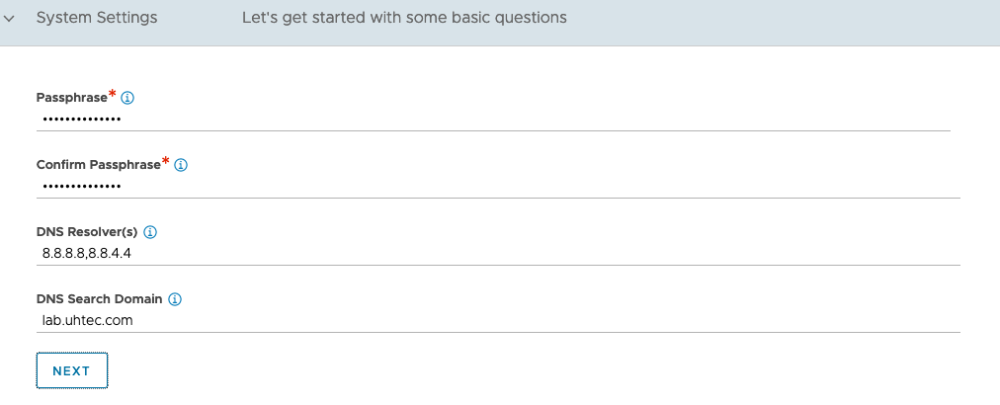
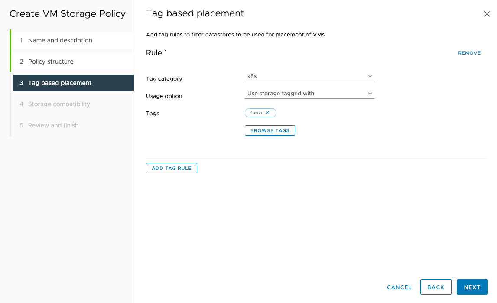
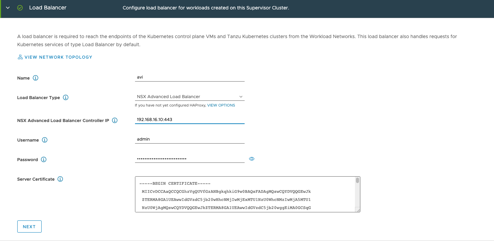

## Overview

In this multi-part series, we will instal Tanzu Kubernetes Grid Service with vSphere 7 and vSphere Networking. With the update of vSphere 7U2, the support for NSX Advanced Load balancer (formaly known as AVI) was added. I'll be using the U3 update for vCenter. 



This is not an official VMware Guide. If you're looking for that, please follow this [guide](https://core.vmware.com/resource/tanzu-proof-concept-guide#poc-guide-overview).



Below you find the coresponding YouTube video of me doing everything described in this article. All files are stored in a [GitHub repository]().

YouTube

If you're looking for an easy automated installation, have a look at William Lam's [repository](https://github.com/lamw/vsphere-with-tanzu-nsx-advanced-lb-automated-lab-deployment). William is building an automated nested environment to get you started in less than an hour.

## Prerequisites

Before we can start, we need to make sure that we meet the minimum criteria for the environment. 

* 3 ESXi hosts with vSphere 7.0 and Enterprise Plus license
* vCenter 7.0 U3
* 3 routed Networks on a distributed switch
  * **Managment Network** with 5 consecutive IP addresses and minimum 8 in total
  * At least one **Workload Network** with the size of the K8s workers you want to support. In this tutorial we'll be using a /24.
  * One **VIP/Frontend Network** with the size of the Load Balancer Service you want to use. At least 1 for each K8s cluster is needed. I'll be using a /24 as well.
  * All networks need to have access to DNS & NTP.
* vSphere HA & DRS need to be enabled on the vSphere cluster

For a full list of requierements have a look at the official [documentation](https://docs.vmware.com/en/VMware-vSphere/7.0/vmware-vsphere-with-tanzu/GUID-7FF30A74-DDDD-4231-AAAE-0A92828B93CD.html). We will be covering the network setup in much more detail in the [vSphere Networking](#vsphere-with-tanzu---vsphere-networking) section. 
 
## vSphere with Tanzu - vSphere Networking

Assume no firewalling

2 Setups converged Workload and Frontend or seperate

### Create Portgroups on the Distributed Switches 

To match our described network setup we need to create 3 portgroups on our distributed switch.

| Portgroup Name       | CIDR            | Gateway      | VLAN |
|----------------------|:---------------:|:------------:|------|
| TanzuMgt-PG-16       | 192.168.16.0/24 | 192.168.16.1 | 16   |
| Tanzu-Workload-PG-15 | 192.168.15.0/24 | 192.168.15.1 | 15   |
| Tanzu-Frontend-PG-14 | 192.168.14.0/24 | 192.168.14.1 | 14   |

## NSX Advanced Loabalancer Instalation

If you haven't downloaded the [NSX Advanced Loadbalancer OVA](https://customerconnect.vmware.com/downloads/details?downloadGroup=NSX-ALB-10&productId=988&rPId=82536) yet please do so. As of this writting I'm using the latest available release, 21.1.3.

We will cover a quick single controller node installation. If you plan to move this into production you would need to create a 3 node cluster setup with a VIP. Please refere to the [documenation](https://docs.vmware.com/en/VMware-vSphere/7.0/vmware-vsphere-with-tanzu/GUID-A51FAF35-D604-4883-A93D-58463B404C4E.html) for details.

After downloading the OVA, import it into the vCenter. Select your managment portgroup for the management network (**TanzuMgt-PG-16**).

For manager configuration select the values from our spredsheet. In the demo environment this resuls in:

* Management Interface IP Adress: 192.168.16.10
* Management Interface Subnet Mask 255.255.255.0
* Default Gateway 192.168.16.1

All other settings are not needed for our setup to work. We're not using an NSX-T network environment. After the configuration power on the VM and put the managment interface IP into your browser. The startup will take a few minutes.

After the webinterface is up you need to create a password for the admin user. The email is optional. This user used for the configuration by the Supervisor Cluster as well.

Next is the basic setup, put in the passphrase for backup and your DNS servers, dns search domain. The email settings are optional. For *Multi-Tenant* leave everything as is. 

Select *Setup Cloud After* before you hit *Save*.

Before we setup anything else in the management console we will first switch the license from the current *Enterprise with Cloud Services Tier* trial one to the *Essentials Tier*. Go to **Administration** at the top and then **Settings > Licensing**. This way we cannot exidentially activate any enterprise features that are not included in the *Essentials Tier*, which is part of the Tanzu Baisc/Standard offering.

Next the *Default-Cloud* needs to be configured. Go to **Infrastructure** and the **Clouds** click on the *geare* icon and select vsphere as the orchestrator. Afterwards click on the pen button to configure the *Default-Cloud*.

Under *Infrastructure* put in the vCenter info and click *Next*.

For *Data Center* select your vSphere Data Center. If you have DHCP in your environment select DHCP here. As discussed in the [vSphere Networking](#vsphere-with-tanzu---vsphere-networking) segment, we assume everything is static. For *Virtual Service Placement Settings* select *Prefere Static Routes vs Directly Connected Network*. 

For the *Network* tab select the *Management Network* from your spredsheet. In the example **TanzuMgt-PG-16**. If the management network uses DHCP select *DHCP Enabled* otherwise put in the IP Subnet. The IP Adress Pool needs to consist of at least 2 IPs. They're used by the service engines. There **should not** be any overlap with the IPs of the Supervisor Cluster VMs.

* IP Subnet: 192.168.16.0/24
* Add Static IP Adress Pool: 192.168.16.11-192.168.16.14
* Default Gateway: 192.168.16.1

After saving everything make sure the *Default-Cloud* has a green circle.

The default ssl certificate of the NSX Advanced Load Balancer doesn't contain the IP address. So we need to generate a new one. Go to **Templates** and then **Security > SSL/TLS Certificates**. Click on *Create* and select *Controller*.

Fill out the certificate. Make sure to put the IP address into the SAN section and the DNS name in to the *Common Name* field. If you only have an IP put in the IP for the *Common Name*. 

Click on the download button of the certificate and copy the certifcate to a text file. We need it later during the installation of the Supervisor Cluster.

Next we need to make use of our newley created certificate. Go to **Administration** and select **Settings > Access Settings**. Click on edit.

Remove all entries in *SLL/TLS Certificate* and select our own certifcate. Activate **Allow Basic Authentication** as well, if you miss this step the installation of the Supervisor Controll Plane will fail.

Now we need to configure the *Service Engine Group*, go to **Infrastructure** and select **Cloud Resources > Service Engine Group**. Click on the edit button for the *Default-Group*.

In the *Basic Settings* make sure that *Legacy HA* is selected. The default *Virtual Services per Service Engine* value of 10, will limit you to 10 Load Balancer Services in your installation. Changes this to e.g. 100.

In the *Advanced* tab, you can change the engine VM prefix and the VM folder. Make sure to select your vSphere cluster in the *Cluster* settings. You can select on which hosts the service engines should run.

Configuring the networks used by the Load Balancer is the next setp. Go to **Infrastructure** and then **Cloud Resources > Networks**. The *Default-Cloud* will show all Portgroups on our Distributed Switch. It will try to detect the subnets. We need to configure the subnet parts we want to use.

The only network we need to configure is the frontend network, as we're using a single leg setup. Click the edit button on the Frontend (**Tanzu-Frontend-PG-14). If the network is using DHCP select it here. Ohterwise put in the information according to the spredsheet.

* IP Subnet: 192.168.14.0/24
* Static IP Adress Pool: 192.168.14.10-192.168.14.100

This allows us to create 90 Load Balancer services starting with *192.168.14.10*.

The NSX Advanced Load Balancer Essential License does not include the *Auto Gateway Detection* feature. So we need to create a deault route. Go to **Infrastructure** and select **Cloud Resources > Routing**. Click Create.

We need to create a default route. The *Next Hop* is the Gateway of our Frontend network.

* Gateway Subnet: 0.0.0.0/0
* Next Hop: 192.168.14.1

After configuring the network and the routing we need to configure the *IPAM Profiles*. Go to **Templates > Profiles > IPAM/DNS Profiles**. Click on Create.

The profile needs a name. Select:

* Cloud for Usable Network: Default-Cloud
* Usable Network: Your Frontend Network (**Tanzu-Frontend-PG-14**)

The final step is to assign the IPAM profile to the *Default-Cloud*. Go to **Infrastructure** and then **Clouds**. Click on the pen button to configure the *Default-Cloud*. Assign the *IPAM Profile* our created profile, (*tanzu-ip*).

This was the last step in the NSX Advanced Loadbalancer setup.

## Supervisor Cluster Instalation

After setting up the network and Load Balancer we now need to configure the content library. The library contains all supported Kubernetes versions.

If you don't already have a storage policy that you would like to use for Kubernetes we need to create one.

After that we have everything we need to finally install the Supervisor controll plane. Make sure you use the spredsheet to keep track of all IPs and settings used.

### Tanzu Content Library

In the vCenter go to **Content Libraries** and click on Create. You need to specify the name, we use *tanzu* for the rest of the tutorial.

Next select *Subscribed content library* and put in the Subscription URL: **[https://wp-content.vmware.com/v2/latest/lib.json](https://wp-content.vmware.com/v2/latest/lib.json)**. Select *Download content: when needed* to save some space. Otherwise it will download 27 vm images for the different Kubernetes versions.

You need to accept the certificate of the content library.

Select the storage you want and hit the finish button on the next page.

Now everything is setup to finally install the Supervisor Cluster.

### Tanzu Storage Policy

The storage for the Supervisor Control Plane the Tanzu Kubernetes Clusters and the Storage Classes within the Kubernetes Cluster can only be assigned if we have *Storage Policy* in place. If you already have one you can skip this section, just put the name in the spreadsheet.

The easiest way to create a new policy is to create a tag based rule for one of your datastores. Click on the *Assign* button.

Click the *ADD TAG*

Put in the name. We use *tanzu*. Then *Create New Category*:

Create a new category, with the Category Name: *k8s*.

Finally assign the tag to the datastore.

Next we need to create a policy based on the tag. Go to **Policies and Profiles > VMS Storage Policies**. Click on *Create*

Give the new policy a name, make sure to use a DNS compliant name. This makes it easier later when we need to reference the name in Kubernetes Deployment files. If you don't create a DNS compliant name, Tanzu will convert it to match the requieremnt. Which will result in diffrences between the UI and the YAML file.
We use **tanzu-storage**, put your name into the spreadsheet for later reference.

We created a tag on our datastore so we need to select *Enable tag based placement rules*. 

The rule to select the storage for our policy is based on *Tag category: k8s* and for the *Tags* click *BROWSE TAGS* and selet *tanzu*. 

You should now see your datastore in the compatible list and click *next* and *finish*.

### Supervisor Control Plane

Now we can start the installation of the Supervisor Control plane. In the vCenter go to **Workload Managment**. Click on the *Get Started* button.

Select the *vSphere Distributed Switch (VDS)* option.

Select the same *Datacenter* and *vSphere Cluster as used in the NSX Advanced Loadbalancer installation. If you're cluster is not listed as compatible make sure you fullfile all requierements.

For the *Control Plane Storage Policy* select the one we created (**tanzu-storage**).

In the Load Balancer section we use the NSX Advanced Load Balancer config.

* Name: avi (just needs to be DNS compliant, not a FQDN)
* Load Balancer Type: NSX Advanced Load Balancer
* NSX Advanced Load Balancer Controller IP: 192.168.16.10:443
* Username: admin
* Password: *****
* Server Certificate: Our self signed certificate that we downloaded

If you installed a Controller cluster, you need to specify the VIP. Make sure to specify the HTTPS port 443 as well as the IP of the controller.

The Management Network section sets up the IPs for the 3 Supervisor Controll Plane VMs. The 4th IP is used for the VIP and the 5th during upgrades. Again make sure that the 5 IPs after the start IP are free and don't overlap with anything else.

* Network Mode: static
* Network: TanzuMgt-PG-16 (your management Network from the spreadsheet)
* Starting IP Adress: 192.168.16.20
* Subnet Mask: 255.255.255.0
* Gateway: 192.168.16.1
* DNS Servers: 8.8.8.8,8.8.4.4
* DNS Search Domains: lab.uhtec.com
* NTP Servers: 192.168.1.130

In the Workload Network section we configure the network for the Tanzu Kubernetes Cluster VMs. At this time you can only configure one Workload Network. Once the installation succeeded you can add additionl Port Groups.

* Network Mode: Static
* Internal Network for Kubernetes Services: 10.96.0.0./23 (leave as is)
* Port Group: **Tanzu-Workload-PG-15** (your primary workload group)
* Network Name: tanzu-workload-pg-15 (needs to be dns compliant)

As this is a static setup we need to configure the usable IP ranges as well. 

* IP Address Ranges: 192.168.15.10-192.168.15.200
* Subnet Mask: 255.255.255.0
* Gateway: 192.168.15.1
* DNS Servers: 8.8.8.8,8.8.4.4
* NTP Servers: 192.168.1.130

For the Tanzu Kubernetes Grid Service we need to select our Content Library: *tanzu*.

In the Review and Confirm section you can configure the *Control Plane Size*. You can leave the default, *small*. If you change this to tiny it will change the *Internal Network for Kubernetes Services* to **10.96.0.0/24** from a **10.96.0.0/23**. 
The *API Server DNS Name* is optional, and will add the DNS name as SAN to the certificate of the controll plane.

## Tanzu Kubernetes Cluster Deployment

After the installation finished the next step is to create our first Tanzu Kubernetes Cluster.