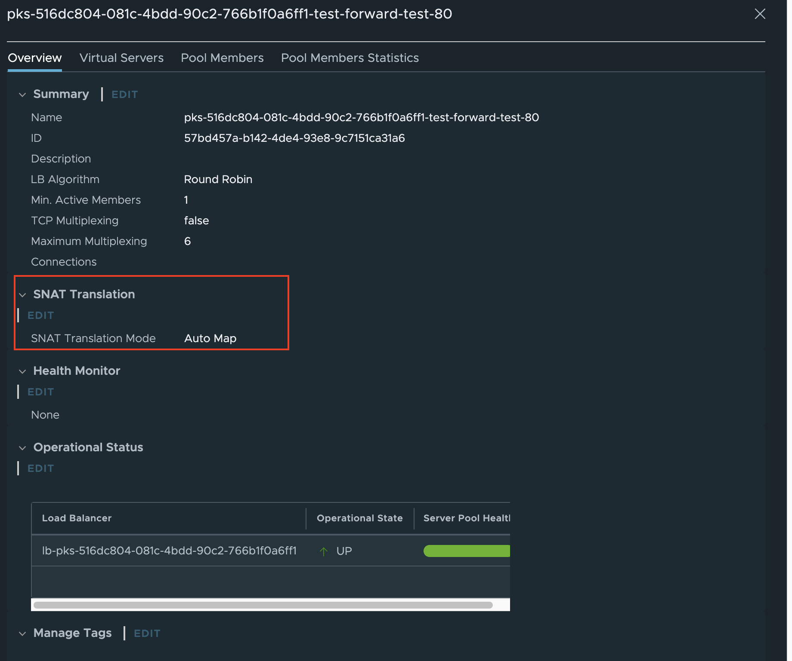
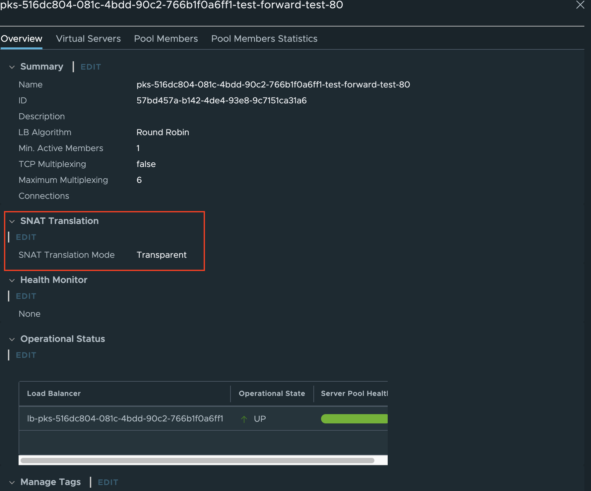

## Using the NSX-T Ingress

A few days ago I came across the requierment to use the [X-Forward-For](https://en.wikipedia.org/wiki/X-Forwarded-For) HTTP header field to get the client IP. Looking at the [documentation](https://docs.pivotal.io/tkgi/1-13/network-profiles-ncp-lb.html) this looks quite easy. Just create a newtork profile and apply this profile during cluster creation.In the profile you need to the the ```x_forward_for```parameter to ```insert```instead of the default ```replace```. So I created the following profile:

```json {linenos=table,hl_lines=[9],linenostart=1}
{
   "name": "forward",
   "description": "x-forward-set",
   "parameters" : {
      "cni_configurations": {
          "type": "nsxt",
          "parameters": {
            "nsx_lb": true,
            "x_forwarded_for": "insert"
            }
        }
     }
 }
 ```

I used a very simple test application to showcase the feature is working. If you want to use it for yourself [ulrix/php-test](https://hub.docker.com/r/ulrix/php-test). Below find the ingress yaml using the NSX-T ingress controller.

```yaml {linenos=table,hl_lines=[6],linenostart=1}
 apiVersion: networking.k8s.io/v1
 kind: Ingress
 metadata:
   name: forward
   annotations:
     kubernetes.io/ingress.class: "nsx"
 spec:
   rules:
   - host: forward-test.lab.uhtec.com
     http:
       paths:
       - path: /
         pathType: Prefix
         backend:
           service:
             name: forward
             port:
               number: 80
```

With this setup everything works as expected. The application can now utilize the X-Forward-For field and see the client IP.

## Custom Ingress Controller

So what happens if I use my own ingress controller instead of the NSX-T one. So my next step was to create a custom ingress with the same Network Profile as before. I know assumed that this would work as well. But it fails the X-Forward-For field is not set and your custom ingress controller will not see the client IP.

If you have a look at the Load Balancer Server Pool in the NSX-T manager you can see that the SNAT Profile is set to AutoMap.



So there's currently no support by TKGI to set this flag to transparent. So I created the small scipt below to use the NSX-T Manager REST API to override this flag and make the SNAT Mode ```transparent```:

<script src="https://gist.github.com/devulrix/84a2ce581662a464f788aa040cd63c41.js"></script>

You need to specifiy the admin user, password, NSX-T Manager URL as well as the Server Pool ID you want to change.

```bash {linenos=false,linenostart=1}
tkgi-nsx-xff.sh -u admin -p VMware1!VMware1! -n https://nsxmgr.... -s 57bd457a-b142-4de4-93e8-9c7151ca31a6
```

Afterwards your Server Pool SNAT Mode is transparent and the X-Forward-For field in the HTTP header of your custom ingress controller is set. This is officialy **not** supported and just a workaround if you need the feature.

